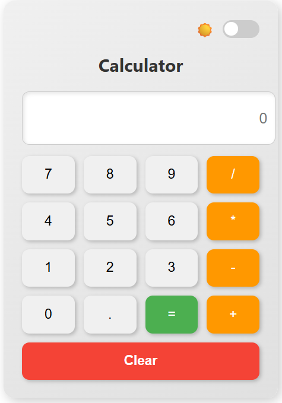
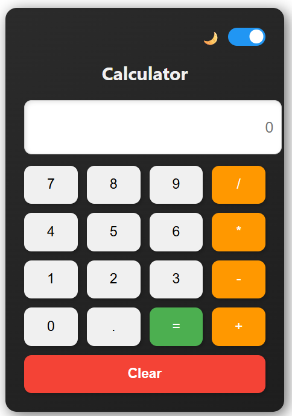

# ⚡ QuantumCalc

An advanced React-based calculator with smooth transitions, history tracking, and a beautiful dark/light mode toggle. Built with **Vite** and deployed to **GitHub Pages**.

---
## 🛠️ Tech Stack
- **React 19**
- **Vite 7**
- **Math.js** for expression evaluation
- **CSS3** for custom theming & transitions
- **GitHub Pages** for deployment
[](https://KailashSatkuri-warangal.github.io/QuantumCalc/)


---

## ✨ Features

- 🌓 **Dark & Light Mode** with animated sun/moon toggle
- 📜 **Calculation History** (clickable results to reuse)
- 🎨 Modern UI with smooth transitions, responsive layout
- ⚡ Fast dev experience with **Vite**
- 🧮 Safe math evaluation using **mathjs**

---
## 🖼️ Screenshots
<p align="center">
  
  &nbsp;
  
</p>
## 📂 Project Structure
---
```
QuantumCalc/
├─ dist/               # Production build (auto-deployed)
├─ public/             # Static assets
├─ src/                # Source code
│  ├─ App.jsx
│  ├─ calculator.jsx
│  ├─ main.jsx
│  ├─ App.css
│  ├─ calculator.css
│  └─ index.css
├─ index.html
├─ package.json
├─ vite.config.js
└─ README.md
```

---

## 🛠️ Installation & Development

Clone the repo and install dependencies:

```bash
git clone https://github.com/KailashSatkuri-warangal/QuantumCalc.git
cd QuantumCalc
npm install
```

Run the development server:

```bash
npm run dev
```

Build for production:

```bash
npm run build
```

Preview the production build locally:

```bash
npm run preview
```

---

## 🚀 Deploy to GitHub Pages (Vite)

1. Ensure `package.json` has:

```json
"homepage": "https://KailashSatkuri-warangal.github.io/QuantumCalc",
"scripts": {
  "predeploy": "npm run build",
  "deploy": "gh-pages -d dist"
}
```

2. Ensure `vite.config.js` sets base:

```js
export default defineConfig({
  base: '/QuantumCalc/',
  plugins: [react()]
})
```

3. Deploy:

```bash
npm run deploy
```

---

## 🧩 Notes & Tips

- If you see deployment errors about a missing `build` folder, use `dist` for Vite (the `gh-pages` destination should be `dist`).
- To auto-deploy on push, add a GitHub Actions workflow that runs `npm ci`, `npm run build`, and `npx gh-pages -d dist` or pushes the `dist` to the `gh-pages` branch.
- Consider adding screenshots and a short demo GIF to `README.md` for better presentation.

---

## 👨‍💻 Author

**Kailash Satkuri** — [GitHub profile](https://github.com/KailashSatkuri-warangal)

---

✨ QuantumCalc – A modern, stylish, and responsive calculator app! ✨